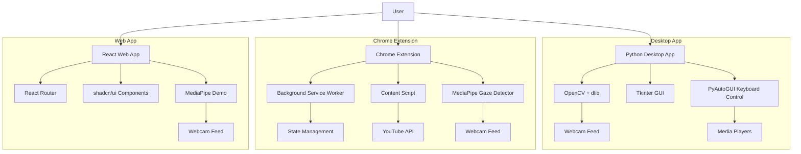
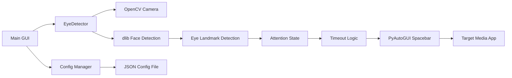
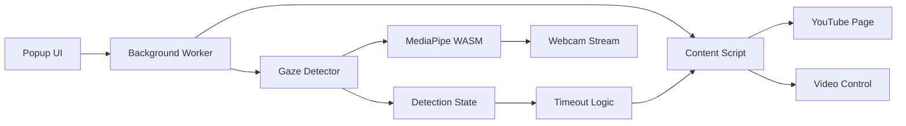
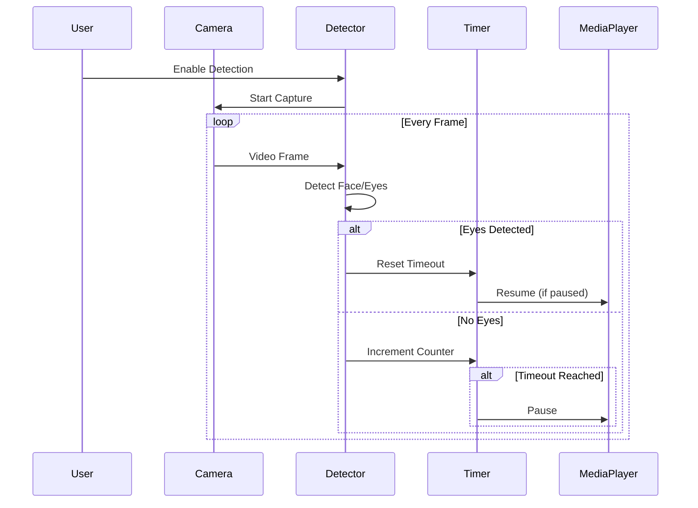

# EyeRemote — Attention-Aware Media Control System

Automatically pause and resume media playback when you look away from the screen — a privacy-focused solution for maintaining attention and reducing digital distraction.

## 🔍 Overview

- **Desktop App**: Python-based webcam eye detection with configurable timeout and multi-face support for VLC, browser media, and desktop players.
- **Chrome Extension**: MediaPipe-powered gaze detection specifically for YouTube with per-tab camera instances and offline processing.
- **Web App**: React-based documentation hub and demo platform showcasing the technology and providing installation guides.

All processing happens **locally and offline** — no cloud dependencies, ensuring privacy and low latency.

## 🧩 Problem, Solution & Impact

- **Problem Solved**: Constantly pausing/resuming videos manually when cooking, multitasking, or getting distracted is tedious; modern attention spans suffer from digital overload; accessibility needs for hands-free media control.
- **How It Solves It**: Uses computer vision (OpenCV + dlib for desktop, MediaPipe for browser) to detect when eyes are looking at the screen; automatically sends pause/play commands when attention shifts.
- **Impact Created**: Reduces friction in media consumption; helps users stay focused on long-form content; provides accessibility for hands-free control; tracks attention patterns for digital wellbeing insights.

---

## 📑 Table of Contents

- [📖 Project Title & Tagline](#eyeremote--attention-aware-media-control-system)
- [🔍 Overview](#-overview)
- [🧩 Problem, Solution & Impact](#-problem-solution--impact)
- [✨ Features](#-features)
- [🎥 Demo](#-demo)
- [🌱 Origin](#-origin)
- [⚡ Quick Start](#-quick-start)
  - [Desktop App Quick Start](#desktop-app-quick-start)
  - [Chrome Extension Quick Start](#chrome-extension-quick-start)
  - [Web App Quick Start](#web-app-quick-start)
- [🧭 Architecture](#-architecture)
- [🛣️ Future Roadmap & Potential Features](#️-future-roadmap--potential-features)
- [🔗 Comparable Projects](#-comparable-projects)
- [🧑‍🎓 Target Users & Use Cases](#-target-users--use-cases)
- [⚠️ Risks & Challenges](#️-risks--challenges)
- [💰 Potential Monetization & Growth Ideas](#-potential-monetization--growth-ideas)
- [📂 Folder Structure](#-folder-structure)
- [🛠 Built With](#-built-with)
- [⚙️ Installation & Setup](#️-installation--setup)
  - [Desktop App Installation](#desktop-app-installation)
  - [Chrome Extension Installation](#chrome-extension-installation)
  - [Web App Installation](#web-app-installation)
- [⚙️ Configuration](#️-configuration)
- [🧪 Testing](#-testing)
- [🚀 Deployment](#-deployment)
- [🐛 Known Issues](#-known-issues)
- [📊 Performance / Optimization](#-performance--optimization)
- [🔒 Privacy & Security](#-privacy--security)
- [🙏 Acknowledgments](#-acknowledgments)
- [👤 Author](#-author)
- [📜 License](#-license)

---

## ✨ Features


### 🌐 Web App Features

- **For Users**
  - ✅ Interactive documentation and guides
  - ✅ Installation instructions for all platforms
  - ✅ Chrome extension download and setup guide
  - ✅ Desktop app feature showcase
  - ✅ Live gaze detection demo (optional)
  - ✅ Responsive design for mobile/tablet
  - ✅ Dark mode support

- **For Developers**
  - ✅ React + TypeScript + Vite stack
  - ✅ shadcn/ui component library
  - ✅ TailwindCSS for styling
  - ✅ React Router for navigation
  - ✅ MediaPipe integration for browser demo
  - ✅ Modular component architecture


### 🖥️ Desktop App Features

- **For Users**
  - ✅ Real-time eye and face detection using webcam
  - ✅ Automatic pause/resume via spacebar key events
  - ✅ Configurable timeout (how long to wait before pausing)
  - ✅ Multi-face support (pause only when all viewers look away)
  - ✅ Target application selection (VLC, browser, any media player)
  - ✅ Visual debug mode with face landmarks overlay
  - ✅ Activity logging and detection statistics
  - ✅ Completely offline — no internet required
  - ✅ Cross-platform (Windows, macOS, Linux)

- **For Developers**
  - ✅ Modular architecture with clean separation of concerns
  - ✅ OpenCV + dlib for robust face/eye detection
  - ✅ PyAutoGUI for cross-platform keyboard events
  - ✅ Tkinter-based GUI with real-time feedback
  - ✅ Comprehensive logging and error handling
  - ✅ Easy-to-extend configuration system

### 🌐 Chrome Extension Features

- **For Users**
  - ✅ Gaze detection using MediaPipe face landmarks
  - ✅ Auto pause/resume for YouTube videos
  - ✅ Configurable timeout and sensitivity settings
  - ✅ Real-time status indicators in popup
  - ✅ Per-tab camera instances (privacy-focused)
  - ✅ Offline MediaPipe processing
  - ✅ YouTube-only permissions (minimal access)

- **For Developers**
  - ✅ Hybrid architecture (background + content scripts)
  - ✅ Manifest V3 compliant
  - ✅ MediaPipe WASM for browser-based face detection
  - ✅ Service worker for state management
  - ✅ YouTube API integration
  - ✅ PowerShell build scripts for packaging


## 🎥 Demo

- **Desktop App**: Launch the app, enable detection, and watch it pause your video player when you look away — resume automatically when you look back.
- **Chrome Extension**: Install in Chrome, navigate to YouTube, enable detection in popup, and experience hands-free pause/resume.
- **Web App**: Visit the live demo at [your-deployed-url] to explore guides and test browser-based gaze detection.

## 🌱 Origin

### Initial Concept (March 2018 — 7 Years Ago)

Back in **March 2018**, when I had just moved out of home, I often wanted to continue watching shows or YouTube videos while cooking for the first time. I realized how inconvenient it was to manually pause or play videos whenever I had to turn away. That's when the idea for a **video player that responds to your eyes** first sparked — a simple script that could detect when you're looking at the screen and automatically play/pause the video.

### Why It Feels Relevant Now (2025)

In today's world, I often catch myself not paying the kind of attention to the content on the big screen in front of me as much as I used to. As a self-proclaimed cinephile and TV connoisseur, this is heartbreaking.

While there are so many other things one should be doing to fix attention spans — getting back to reading, putting phones on flight mode, practicing mindfulness — I couldn't help but wonder if my borderline dystopian idea from 2018 could be leveraged in this Black Mirror-esque world to actually help people stay focused on long-form content.

### Why I Couldn't Build It Then

I remember building a very slightly working prototype which could detect the eyeballs. I'm not sure why I abandoned building it into a full-fledged project at the time — likely a combination of limited computer vision knowledge, unclear use case, and shifting priorities.

**Idea Date**: March 2018

**Possible Names Considered**:
- SightSync
- EyePause
- GazePlay

### Potential Inspiration Sources

- [Eye Motion Tracking OpenCV with Python](https://pysource.com/2019/01/04/eye-motion-tracking-opencv-with-python/)
- [Hands-Free Coding by Josh W. Comeau](https://www.joshwcomeau.com/blog/hands-free-coding/)

---

## ⚡ Quick Start

### Desktop App Quick Start

```bash
# Clone the repository
git clone https://github.com/yourusername/eyeremote.git
cd eyeremote/eyeremote-deskapp

# Run the automated installer (Windows)
installers\install.bat

# OR run the automated installer (macOS/Linux)
chmod +x installers/install.sh
installers/install.sh

# Launch the application
python eyeremote.py
```

### Chrome Extension Quick Start

```bash
# Navigate to extension directory
cd eyeremote/eyeremote-chromeext

# Download MediaPipe assets (Windows PowerShell)
.\download_mediapipe.ps1

# Load unpacked extension in Chrome
# 1. Open chrome://extensions/
# 2. Enable "Developer mode"
# 3. Click "Load unpacked" and select eyeremote-chromeext folder
# 4. Grant camera permissions when prompted
```

### Web App Quick Start

```bash
# Clone and navigate to project root
git clone https://github.com/yourusername/eyeremote.git
cd eyeremote

# Install dependencies
npm install

# Start development server
npm run dev

# Build for production
npm run build
npm run preview
```

---

## 🧭 Architecture

### System Overview



### Desktop App Architecture



### Chrome Extension Architecture



### Detection Flow



---

## 🛣️ Future Roadmap & Potential Features

### 📊 Attention Analytics
- **Logs**: Track how long user was attentive vs. distracted
- **Digital Wellbeing Tracker**: Matplotlib dashboard showing attention over time
- **Attention Graphs**: Visualize attentive vs. distracted durations
- **Pattern Detection**: Identify binge-watching habits or distraction triggers

### 🎵 Audio & Visual Enhancements
- **Audio Cue Mode**: Lower system volume or fade audio instead of pausing
- **Smart Ambient Mode**: Dim screen or trigger ambient visuals when eyes are away
- **Voice Alerts**: Optional audio notifications for state changes

### 🎯 Focus & Productivity
- **Focus Mode Integration**: Block short-form apps or websites when watching long-form content
- **Eye-Aware Productivity Suite**: Extend to coding, reading, studying scenarios
- **Multi-Monitor Support**: Track which screen user is watching

### 🤝 Collaboration & Social
- **Multi-user Calibration**: Pause only when all watchers look away
- **Shared Viewing Stats**: Compare attention metrics with friends
- **Group Watch Mode**: Coordinate playback for remote viewing parties

### 🧠 Advanced Detection
- **Emotion Recognition**: Detect engagement level, not just presence
- **Distraction Classification**: Identify phone checking, side conversations
- **Learning Optimization**: Adjust timeout based on content type and user patterns

### 🌐 Platform Expansion
- **Mobile Apps**: iOS/Android versions with camera-based detection
- **Smart TV Integration**: Native apps for major TV platforms
- **Game Console Support**: Xbox/PlayStation media control
- **VR/AR Headset**: Eye tracking for immersive media

---

## 🔗 Comparable Projects

| Project | Platform | Key Features | How EyeRemote Differs |
|---------|----------|--------------|----------------------|
| **FacePause** | Android | Pauses games/video when you leave webcam view | Multi-platform; configurable timeout; multi-face support; open source |
| **Tobii Eye Tracker** | Hardware + Software | Commercial eye tracking with gaming/productivity focus | Software-only; no hardware required; privacy-focused offline processing |
| **Eye Tracking Demos** | OpenCV tutorials | Educational eye detection examples | Production-ready apps; full media control; attention analytics roadmap |


### How This Project Differs

- **Entirely software-based** — no external hardware required
- **Cross-platform** — desktop app works on Windows, macOS, Linux; extension works on Chrome/Edge
- **Privacy-first** — completely offline processing, no cloud dependencies
- **Designed for attention management** — not just gaze detection, but helping users stay focused
- **Multi-app support** — works with VLC, YouTube, Netflix, and any media player
- **Open source** — community-driven development and transparent implementation

---

## 🧑‍🎓 Target Users & Use Cases

| User Type | Use Case | Benefit |
|-----------|----------|---------|
| **Casual Watchers** | Auto-pause Netflix/YouTube when distracted or stepping away | Convenience; never miss a moment |
| **Cooking Enthusiasts** | Watch recipe videos hands-free while cooking | Safety; hygiene; uninterrupted learning |
| **Students** | Maintain focus during online lectures or tutorials | Better retention; attention tracking |
| **Productivity Users** | Track attention during work/study sessions | Digital wellbeing insights; reduce multitasking |
| **Couples/Friends** | Shared viewing with pause when anyone looks away | Coordinated experience; no manual coordination |
| **Accessibility Users** | Hands-free video control for mobility-impaired users | Independence; ease of use |
| **Parents** | Pause children's content when they're not watching | Screen time management; content awareness |
| **Fitness Enthusiasts** | Follow workout videos without manual pause/resume | Seamless training; hygiene |

---

## ⚠️ Risks & Challenges

### Technical Challenges

- **False Positives**: Brief eye movements or head turns might trigger unintended pauses
  - *Solution*: Smoothing filters + configurable timeout (default 2-3 seconds)

- **Lighting & Camera Quality**: Poor lighting or low-quality webcams reduce detection accuracy
  - *Solution*: Adjustable thresholds; debug mode to test conditions; recommendations for setup

- **Multi-Monitor Scenarios**: Hard to detect which screen user is watching
  - *Solution*: Future roadmap feature; currently assumes single primary display

- **Performance Impact**: Continuous video processing can use CPU/battery
  - *Solution*: Optimized frame rates; GPU acceleration where available; idle detection

### User Experience Challenges

- **App Focus Issues**: Sending key events to the correct window across different OSes
  - *Solution*: Manual target app selection; platform-specific handlers

- **Learning Curve**: Users need to understand timeout settings and calibration
  - *Solution*: Sensible defaults; interactive setup wizard; visual feedback

### Privacy & Trust

- **Privacy Perception**: Webcam usage requires clear user consent and transparency
  - *Solution*: Prominent privacy notices; offline-only processing; open-source code
  - *Benefit*: No data collection, storage, or transmission

- **Security Concerns**: Malware could misuse webcam access
  - *Solution*: Code audits; signed releases; minimal permissions; open development

---

## 💰 Potential Monetization & Growth Ideas

### Direct Revenue

- **Freemium Model**
  - Free: Basic detection with standard timeout
  - Premium ($4.99/month or $39.99/year): Attention analytics dashboard, multi-user mode, advanced features

- **One-Time Purchase** ($29.99)
  - Lifetime access to desktop app + extension
  - Free updates and bug fixes

### B2B Opportunities

- **Corporate Wellbeing Add-on**: Integrate into workplace productivity suites
  - License to companies for employee focus tracking (ethical implementation required)
  - Privacy-focused attention analytics for remote work

- **Educational Institutions**: Site licenses for online learning platforms
  - Help students stay focused during remote classes
  - Provide attention metrics to educators (anonymized)

### Platform & Partnerships

- **Hardware Bundles**: Partner with webcam manufacturers
  - Pre-configured USB cameras with EyeRemote software
  - "TV Focus Mode" kits for living room setups

- **Travel & Hospitality**: In-flight entertainment integration
  - Airlines license for seatback entertainment systems
  - Hotels offer as premium room feature

### Community & Open Source

- **Open-Source Core** with optional premium features
  - Developer version for computer vision and UX research
  - Community contributions for new features and platform support

- **API Access**: Paid API for third-party integrations
  - Enable other apps to use attention detection
  - Usage-based pricing model

### Content & Training

- **Focus Coaching**: Subscription service with attention training programs
  - Gamified challenges to improve focus duration
  - Personalized recommendations based on attention patterns

---

## 📂 Folder Structure

```
eyeremote/
├── eyeremote-deskapp/                  # Python Desktop Application
│   ├── app/
│   │   ├── __init__.py
│   │   ├── main.py                     # Main GUI application
│   │   ├── eye_detector.py             # Core detection logic
│   │   ├── config.py                   # Configuration management
│   │   └── utils.py                    # Helper utilities
│   ├── docs/
│   │   ├── QUICKSTART.md              # Quick start guide
│   │   ├── TECHNICAL.md               # Technical documentation
│   │   └── AppScreen.png              # Screenshot
│   ├── installers/
│   │   ├── install.bat                # Windows installer
│   │   ├── install.sh                 # macOS/Linux installer
│   │   └── run.bat                    # Windows launcher
│   ├── models/
│   │   ├── .gitkeep
│   │   └── download_models.py         # Download dlib models
│   ├── scripts/
│   │   ├── debug.py                   # Debug window
│   │   ├── setup.py                   # Setup utilities
│   │   ├── test_eye_detection.py      # Detection tests
│   │   ├── test_keypress.py           # Keyboard tests
│   │   └── test_setup.py              # Setup tests
│   ├── eyeremote.py                   # Main entry point
│   ├── requirements.txt               # Python dependencies
│   └── README.md                      # Desktop app README
│
├── eyeremote-chromeext/               # Chrome Extension
│   ├── icons/
│   │   ├── icon16.png
│   │   ├── icon48.png
│   │   └── icon128.png
│   ├── lib/                           # MediaPipe assets (after download)
│   │   ├── tasks-vision/
│   │   └── wasm/
│   ├── manifest.json                  # Extension manifest
│   ├── popup.html                     # Extension popup UI
│   ├── popup.js                       # Popup logic
│   ├── background.js                  # Service worker
│   ├── content.js                     # YouTube integration
│   ├── gazeDetector.js               # MediaPipe gaze detection
│   ├── download_mediapipe.ps1        # Download MediaPipe
│   ├── build.ps1                     # Package extension
│   └── README.md                     # Extension README
│
├── src/                               # React Web App
│   ├── components/
│   │   ├── ui/                       # shadcn/ui components
│   │   ├── ChromeExtensionBanner.tsx
│   │   ├── DesktopAppBanner.tsx
│   │   ├── GazeDetector.tsx          # Browser gaze demo
│   │   ├── Navbar.tsx
│   │   ├── SettingsPanel.tsx
│   │   ├── StatusIndicator.tsx
│   │   ├── URLInput.tsx
│   │   └── VideoPlayer.tsx
│   ├── pages/
│   │   ├── Index.tsx                 # Home page
│   │   ├── ExtensionGuide.tsx        # Extension guide
│   │   └── NotFound.tsx              # 404 page
│   ├── hooks/
│   │   ├── use-mobile.tsx
│   │   └── use-toast.ts
│   ├── lib/
│   │   └── utils.ts                  # Utility functions
│   ├── App.tsx                       # Main app component
│   ├── main.tsx                      # Entry point
│   ├── index.css                     # Global styles
│   └── vite-env.d.ts                # TypeScript definitions
│
├── public/                           # Static assets
│   ├── icons/                        # App icons
│   ├── eyeremote-chromeext.crx      # Packaged extension
│   └── robots.txt
│
├── index.html                        # HTML entry point
├── vite.config.ts                    # Vite configuration
├── tailwind.config.ts                # Tailwind configuration
├── package.json                      # Node dependencies
└── README.md                         # This file
```

---

## 🛠 Built With

### Desktop App (Python)

| Component | Technology | Purpose |
|-----------|-----------|---------|
| GUI Framework | Tkinter | Cross-platform desktop interface |
| Computer Vision | OpenCV | Camera capture and image processing |
| Face Detection | dlib | Robust face and eye landmark detection |
| Keyboard Control | PyAutoGUI | Cross-platform keyboard event simulation |
| Configuration | JSON | Persistent settings storage |
| Logging | Python logging | Activity tracking and debugging |

### Chrome Extension (JavaScript)

| Component | Technology | Purpose |
|-----------|-----------|---------|
| Face Detection | MediaPipe (WASM) | Browser-based face landmark detection |
| Manifest | V3 | Modern Chrome extension architecture |
| Background | Service Worker | State management and coordination |
| Content Script | Vanilla JS | YouTube page integration |
| UI | HTML/CSS | Extension popup interface |
| Build Tools | PowerShell | Asset download and packaging |

### Web App (React)

| Component | Technology | Purpose |
|-----------|-----------|---------|
| Framework | React 18 | UI component library |
| Language | TypeScript | Type-safe development |
| Build Tool | Vite | Fast development and building |
| Styling | TailwindCSS | Utility-first CSS framework |
| UI Components | shadcn/ui | Pre-built accessible components |
| Router | React Router 6 | Client-side routing |
| Animations | Framer Motion | Smooth transitions and effects |
| Media Player | React Player | Video playback component |
| Gaze Detection | MediaPipe | Browser-based demo |
| Icons | Lucide React | Icon library |

---

## ⚙️ Installation & Setup

### Desktop App Installation

#### Prerequisites

- **Operating System**: Windows 10+, macOS 10.14+, or Linux (Ubuntu 20.04+)
- **Python**: Version 3.8 or higher
- **Webcam**: Built-in or USB webcam
- **Media Player**: VLC, browser, or any keyboard-controllable player

#### Automated Installation (Recommended)

**Windows:**
```bash
cd eyeremote-deskapp
installers\install.bat
```

**macOS/Linux:**
```bash
cd eyeremote-deskapp
chmod +x installers/install.sh
installers/install.sh
```

The installer will:
1. Check Python version (3.8+ required)
2. Install required packages from `requirements.txt`
3. Download dlib face detection models
4. Verify installation and dependencies

#### Manual Installation

```bash
cd eyeremote-deskapp

# Create virtual environment (optional but recommended)
python -m venv venv
source venv/bin/activate  # On Windows: venv\Scripts\activate

# Install dependencies
pip install -r requirements.txt

# Download face detection models
python models/download_models.py

# Verify installation
python scripts/test_setup.py
```

#### Running the Desktop App

```bash
python eyeremote.py
```

Or use the launcher scripts:
- Windows: `installers\run.bat`
- macOS/Linux: `python eyeremote.py`

---

### Chrome Extension Installation

#### Prerequisites

- **Browser**: Google Chrome or Microsoft Edge (Chromium-based)
- **PowerShell**: Windows PowerShell 5.1+ (for asset download script)
- **Webcam**: Built-in or USB webcam

#### Step 1: Download MediaPipe Assets

```powershell
cd eyeremote-chromeext
.\download_mediapipe.ps1
```

This downloads the MediaPipe face detection model and WASM files to the `lib/` directory.

**Manual Download Alternative:**
If PowerShell script fails, manually download from:
- MediaPipe Tasks Vision: https://cdn.jsdelivr.net/npm/@mediapipe/tasks-vision@latest/
- Place files in `eyeremote-chromeext/lib/` directory

#### Step 2: Load Unpacked Extension

1. Open Chrome/Edge and navigate to `chrome://extensions/`
2. Enable **Developer mode** (toggle in top right)
3. Click **"Load unpacked"**
4. Select the `eyeremote-chromeext` folder
5. Grant camera permissions when prompted

#### Step 3: Pin Extension (Optional)

1. Click the puzzle icon in Chrome toolbar
2. Find "EyeRemote"
3. Click the pin icon to keep it visible

#### Usage

1. Navigate to any YouTube video
2. Click the EyeRemote extension icon
3. Toggle "Enable Detection"
4. Adjust timeout settings as needed
5. Video will auto-pause when you look away

---

### Web App Installation

#### Prerequisites

- **Node.js**: Version 18+ recommended
- **npm**: Version 8+ (comes with Node.js)

#### Development Setup

```bash
# Clone repository (if not already cloned)
git clone https://github.com/yourusername/eyeremote.git
cd eyeremote

# Install dependencies
npm install

# Start development server
npm run dev
```

The app will be available at `http://localhost:5173` (or next available port).

#### Production Build

```bash
# Build for production
npm run build

# Preview production build locally
npm run preview

# Deploy dist/ folder to hosting service
```

#### Environment Variables (Optional)

Create a `.env` file in project root for custom configuration:

```bash
# Optional: Custom port for dev server
VITE_PORT=3000

# Optional: API endpoints for future features
VITE_API_URL=https://your-api-endpoint.com
```

---

## ⚙️ Configuration

### Desktop App Configuration

Configuration is stored in `eyeremote_config.json` (created automatically on first run).

**Default Configuration:**
```json
{
  "timeout_seconds": 3,
  "max_faces": 1,
  "target_application": "All Applications",
  "camera_index": 0,
  "eye_detection_threshold": 0.3,
  "show_face_landmarks": false,
  "log_activity": true
}
```

**Configuration Options:**

| Setting | Type | Default | Description |
|---------|------|---------|-------------|
| `timeout_seconds` | Integer | 3 | Seconds to wait before pausing |
| `max_faces` | Integer | 1 | Number of faces required to be watching |
| `target_application` | String | "All Applications" | Window to send keyboard events to |
| `camera_index` | Integer | 0 | Camera device index (0 = default) |
| `eye_detection_threshold` | Float | 0.3 | Detection sensitivity (0.0 - 1.0) |
| `show_face_landmarks` | Boolean | false | Show debug overlay with landmarks |
| `log_activity` | Boolean | true | Enable activity logging |

**Editing Configuration:**
- Use the GUI settings panel (recommended)
- Or manually edit `eyeremote_config.json` (restart required)

### Chrome Extension Configuration

Settings are accessible via the extension popup.

**Available Settings:**

| Setting | Type | Default | Description |
|---------|------|---------|-------------|
| Timeout | Slider | 2000ms | Milliseconds to wait before pausing |
| Detection Status | Toggle | Off | Enable/disable gaze detection |
| Tab-specific | Automatic | Per-tab | Each tab has independent detection state |

**Changing Settings:**
1. Click extension icon
2. Adjust timeout slider (500ms - 5000ms)
3. Toggle detection on/off
4. Settings persist across browser sessions

### Web App Configuration

Minimal configuration required. Customization via:

**Tailwind Config** (`tailwind.config.ts`):
- Theme colors
- Breakpoints
- Custom utilities

**Vite Config** (`vite.config.ts`):
- Build options
- Plugin configuration
- Path aliases

---

## 🧪 Testing

### Desktop App Testing

**Test Eye Detection:**
```bash
cd eyeremote-deskapp
python scripts/test_eye_detection.py
```
- Shows live camera feed with detection status
- Press 's' to toggle face landmark visualization
- Press 'q' to quit

**Test Keyboard Events:**
```bash
python scripts/test_keypress.py
```
- Opens notepad/text editor
- Sends spacebar events to verify key simulation
- Useful for diagnosing media control issues

**Test Setup:**
```bash
python scripts/test_setup.py
```
- Verifies all dependencies installed
- Checks camera access
- Downloads missing models if needed

**Debug Mode:**
```bash
python scripts/debug.py
```
- Interactive debug window
- Real-time FPS and detection statistics
- Visual face/eye detection overlay

### Chrome Extension Testing

**Manual Testing:**
1. Load unpacked extension
2. Open Chrome DevTools (`F12`)
3. Navigate to YouTube video
4. Enable detection in extension popup
5. Monitor console for logs:
   - `popup.js`: Popup interaction logs
   - `background.js`: Background worker logs
   - `content.js`: YouTube integration logs
   - `gazeDetector.js`: Detection logs

**Testing Checklist:**
- [ ] Camera permission granted
- [ ] Detection toggle works
- [ ] Timeout slider updates correctly
- [ ] Video pauses when looking away
- [ ] Video resumes when looking back
- [ ] Status indicator updates in popup
- [ ] Works across multiple tabs independently

### Web App Testing

**Run Development Server:**
```bash
npm run dev
```
- Hot module replacement for instant feedback
- Check browser console for errors
- Test responsive design with DevTools device emulation

**Linting:**
```bash
npm run lint
```

**Build Test:**
```bash
npm run build
npm run preview
```
- Verify production build works
- Check bundle size
- Test all routes

---

## 🚀 Deployment

### Desktop App Deployment

**Distribution Options:**

1. **Source Distribution**
   - Share the GitHub repository
   - Users follow installation instructions
   - Best for open-source community

2. **Executable Packaging** (Future)
   - Use PyInstaller or py2exe to create standalone executables
   - Bundle Python runtime and dependencies
   - Simplest for end users

```bash
# Example PyInstaller command (not yet implemented)
pyinstaller --onefile --windowed --icon=icon.ico eyeremote.py
```

3. **Installer Packages** (Future)
   - Create `.exe` installer for Windows (Inno Setup)
   - Create `.dmg` for macOS
   - Create `.deb`/`.rpm` for Linux

### Chrome Extension Deployment

**Option 1: Chrome Web Store (Recommended for Public)**

1. Create developer account ($5 one-time fee)
2. Package extension:
   ```powershell
   cd eyeremote-chromeext
   .\build.ps1
   ```
3. Upload to Chrome Web Store dashboard
4. Fill in store listing details
5. Submit for review (1-3 days)

**Option 2: Direct Distribution (Private)**

1. Package as `.crx` file (already included in `public/`)
2. Host on your website
3. Users download and drag into Chrome extensions page
4. Chrome will warn about "unverified developer"

**Option 3: Enterprise Distribution**

- Use Chrome Enterprise policies
- Deploy via Google Admin Console
- No Web Store approval needed

### Web App Deployment

**Recommended Hosting: Vercel/Netlify (Free Tier Available)**

**Deploy to Vercel:**
```bash
# Install Vercel CLI
npm install -g vercel

# Deploy
vercel --prod
```

**Deploy to Netlify:**
```bash
# Install Netlify CLI
npm install -g netlify-cli

# Build and deploy
npm run build
netlify deploy --prod --dir=dist
```

**Deploy to GitHub Pages:**
```bash
# Build
npm run build

# Deploy dist/ folder to gh-pages branch
npm run deploy  # (requires gh-pages package)
```

**Static Hosting Providers:**
- Vercel (Recommended)
- Netlify
- GitHub Pages
- Cloudflare Pages
- AWS S3 + CloudFront
- Firebase Hosting

**Build Output:**
- All builds create a `dist/` folder
- Upload `dist/` contents to any static host
- No server-side rendering required

---

## 🐛 Known Issues

### Desktop App

| Issue | Severity | Workaround | Status |
|-------|----------|------------|--------|
| False positives with brief head movements | Low | Increase timeout setting | By design |
| Poor detection in low light | Medium | Improve lighting; adjust threshold | Documented |
| Doesn't work with fullscreen apps on macOS | Medium | Use windowed mode | Investigating |
| High CPU usage on older machines | Low | Lower camera resolution; reduce FPS | Future optimization |
| Multi-monitor detection unclear | Low | Use on primary monitor | Future feature |

### Chrome Extension

| Issue | Severity | Workaround | Status |
|-------|----------|------------|--------|
| Doesn't work on other video sites | Low | Desktop app supports all sites | By design (YouTube-only) |
| Camera permission needs manual grant | Low | Browser security requirement | Expected behavior |
| Slight delay before pause/resume | Low | Adjust timeout setting | Acceptable latency |
| Doesn't persist across browser restarts | Medium | Re-enable in popup after restart | Investigating |

### Web App

| Issue | Severity | Workaround | Status |
|-------|----------|------------|--------|
| Gaze demo requires HTTPS | Medium | Use localhost or HTTPS deployment | Browser security |
| Large bundle size (~2MB with MediaPipe) | Low | Code splitting; lazy loading | Future optimization |
| No mobile camera support for demo | Low | Desktop-only feature | By design |

---

## 📊 Performance / Optimization

### Desktop App Performance

**Current Metrics:**
- **Detection FPS**: 15-30 FPS (depending on hardware)
- **CPU Usage**: 10-20% on modern hardware
- **Memory Usage**: ~150-250 MB
- **Latency**: <100ms from eye movement to detection

**Optimization Strategies:**
- Frame rate throttling (process every Nth frame)
- Configurable detection resolution
- GPU acceleration where available (future)
- Multi-threading for camera capture and processing

### Chrome Extension Performance

**Current Metrics:**
- **Detection Rate**: 10 FPS (hardcoded for battery efficiency)
- **Memory Usage**: ~50-100 MB per tab
- **Battery Impact**: Low (pauses detection when tab inactive)

**Optimization Strategies:**
- Tab-level detection (paused on inactive tabs)
- MediaPipe WASM for native performance
- Efficient landmark processing (only necessary points)
- Debounced state updates

### Web App Performance

**Current Metrics:**
- **Initial Load**: ~1.5s (with MediaPipe demo)
- **Bundle Size**: ~500KB (minified + gzipped)
- **Lighthouse Score**: 90+ Performance

**Optimization Strategies:**
- Code splitting for MediaPipe demo
- Lazy loading of components
- Image optimization (WebP, responsive images)
- TailwindCSS purging (unused styles removed)

---

## 🔒 Privacy & Security

### Privacy Guarantees

✅ **100% Offline Processing**
- All face/eye detection happens locally on your device
- No video or image data is ever transmitted to servers
- No internet connection required for core functionality

✅ **No Data Collection**
- We don't collect, store, or transmit any personal data
- No analytics, tracking, or telemetry
- Configuration files stored locally only

✅ **Camera Access Transparency**
- Camera access only when detection is explicitly enabled
- Clear visual indicators when camera is active
- Easy toggle to disable at any time

✅ **Open Source**
- All code is publicly auditable on GitHub
- No hidden backdoors or data exfiltration
- Community-reviewed security

### Security Best Practices

🔒 **For Users:**
- Download only from official sources (GitHub, Chrome Web Store)
- Review permissions before installing
- Keep software updated for security patches
- Disable detection when not needed

🔒 **For Developers:**
- Code signing for desktop app releases (future)
- Chrome Web Store verification
- Regular security audits
- Dependency vulnerability scanning

### Data Storage

| Data Type | Location | Purpose | Retention |
|-----------|----------|---------|-----------|
| Configuration | Local JSON file | User preferences | Until manual deletion |
| Activity Logs | Local text file | Debugging, statistics | Until manual deletion |
| Extension Settings | Chrome Local Storage | User preferences | Until extension uninstall |
| Video Frames | RAM only (never saved) | Real-time processing | Immediate disposal |

### Permissions Required

**Desktop App:**
- Camera access (for eye detection)
- Keyboard event simulation (for media control)

**Chrome Extension:**
- Camera access (for gaze detection)
- YouTube page access (for video control)
- Local storage (for settings persistence)

**Web App:**
- Camera access (optional, for demo only)
- No special permissions required for documentation

---

## 🙏 Acknowledgments


### Open Source Community

- **OpenCV**: Computer vision library powering desktop detection
- **dlib**: Robust face and eye landmark detection
- **MediaPipe**: Google's ML solution for browser-based face detection
- **React Ecosystem**: Vite, TailwindCSS, shadcn/ui for web app
- **Python Community**: PyAutoGUI, Tkinter, and countless tutorials


---

## 👤 Author

**Karan Gupta**

- GitHub: [@yourusername](https://github.com/yourusername)
- Email: your.email@example.com
- Project Link: [https://github.com/yourusername/eyeremote](https://github.com/yourusername/eyeremote)

---

## 📜 License

MIT License

Copyright (c) 2025 Karan Gupta

Permission is hereby granted, free of charge, to any person obtaining a copy
of this software and associated documentation files (the "Software"), to deal
in the Software without restriction, including without limitation the rights
to use, copy, modify, merge, publish, distribute, sublicense, and/or sell
copies of the Software, and to permit persons to whom the Software is
furnished to do so, subject to the following conditions:

The above copyright notice and this permission notice shall be included in all
copies or substantial portions of the Software.

THE SOFTWARE IS PROVIDED "AS IS", WITHOUT WARRANTY OF ANY KIND, EXPRESS OR
IMPLIED, INCLUDING BUT NOT LIMITED TO THE WARRANTIES OF MERCHANTABILITY,
FITNESS FOR A PARTICULAR PURPOSE AND NONINFRINGEMENT. IN NO EVENT SHALL THE
AUTHORS OR COPYRIGHT HOLDERS BE LIABLE FOR ANY CLAIM, DAMAGES OR OTHER
LIABILITY, WHETHER IN AN ACTION OF CONTRACT, TORT OR OTHERWISE, ARISING FROM,
OUT OF OR IN CONNECTION WITH THE SOFTWARE OR THE USE OR OTHER DEALINGS IN THE
SOFTWARE.

---

## 🚀 Getting Started Checklist

### First-Time Users

- [ ] Choose your platform (Desktop App, Chrome Extension, or both)
- [ ] Follow installation instructions for your chosen platform
- [ ] Configure timeout settings based on your preferences
- [ ] Test with a sample video to verify detection works
- [ ] Adjust settings for optimal experience
- [ ] Read privacy policy and understand offline processing

### Desktop App Users

- [ ] Install Python 3.8+
- [ ] Run installer script
- [ ] Launch `eyeremote.py`
- [ ] Select target application (VLC, browser, etc.)
- [ ] Configure timeout and max faces
- [ ] Enable detection and test with media

### Chrome Extension Users

- [ ] Download MediaPipe assets
- [ ] Load unpacked extension in Chrome
- [ ] Grant camera permissions
- [ ] Navigate to YouTube video
- [ ] Enable detection in popup
- [ ] Adjust timeout as needed

### Web App Users

- [ ] Visit deployed site or run locally
- [ ] Read documentation and guides
- [ ] Explore gaze detection demo (optional)
- [ ] Download desktop app or extension
- [ ] Share feedback and contribute

