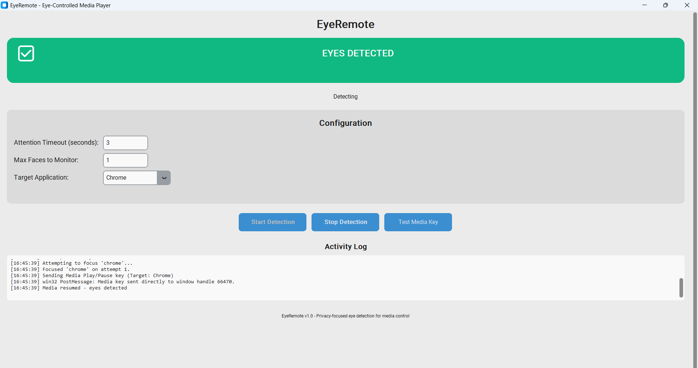

# EyeRemote

EyeRemote is a privacy-focused desktop application that uses your webcam to detect when you're looking at the screen. When you look away for more than a specified time, it automatically pauses your media playback. When you look back, it resumes automatically.

## Features

- **Eye Detection**: Uses computer vision to detect when you're looking at the screen
- **Media Control**: Automatically pauses/resumes media in VLC, YouTube, Netflix, and other players
- **Privacy-First**: All processing happens locally - no cloud dependencies
- **Configurable**: Adjustable timeout, target applications, and detection sensitivity
- **Multi-Face Support**: Monitor multiple people watching together
- **Low Latency**: Real-time detection with minimal system impact



## Requirements

- Windows 10/11, macOS 10.14+, or Linux
- Python 3.7 or higher
- Webcam
- Media player (VLC, browser with YouTube/Netflix, etc.)

## Quick Start

1. **Clone or download** this repository
2. **Run setup**:
   ```bash
   # Windows
   installers/install.bat
   
   # macOS/Linux
   installers/install.sh
   ```
3. **Launch the application**:
   ```bash
   python eyeremote.py
   ```
   Or double-click `installers/run.bat` on Windows

## Manual Installation

If the automatic setup doesn't work:

1. **Install dependencies**:
   ```bash
   pip install -r requirements.txt
   ```

2. **Download facial landmarks predictor**:
   ```bash
   python models/download_models.py
   ```
   Or manually download from: http://dlib.net/files/shape_predictor_68_face_landmarks.dat.bz2

3. **Run the application**:
   ```bash
   python eyeremote.py
   ```

## Usage

1. **Start Detection**: Click "Start Detection" to begin monitoring
2. **Configure Settings**:
   - **Attention Timeout**: How long to wait before pausing (default: 3 seconds)
   - **Max Faces**: Number of people to monitor (1-5)
   - **Target Application**: Specific app to control (Any, VLC, Chrome, etc.)
3. **Test**: Use "Test Spacebar" to verify keyboard automation works
4. **Monitor**: Watch the activity log for detection status

## How It Works

1. **Face Detection**: Uses OpenCV and dlib to detect faces in the webcam feed
2. **Eye Tracking**: Analyzes facial landmarks to determine if eyes are open and facing forward
3. **Timeout Logic**: Tracks when eyes are last seen and triggers pause after timeout
4. **Media Control**: Sends spacebar key events to the active application window
5. **Resume Detection**: Automatically resumes when eyes are detected again

## Configuration

Settings are automatically saved in `eyeremote_config.json`:

- `timeout`: Seconds to wait before pausing (1-30)
- `max_faces`: Maximum faces to monitor (1-5)
- `target_app`: Target application filter
- `camera_index`: Camera to use (0 for default)
- `eye_ar_threshold`: Eye detection sensitivity (0.1-0.5)

## Troubleshooting

### Camera Issues
- Ensure webcam is connected and not used by other applications
- Try changing camera index in settings
- Check camera permissions in system settings

### Detection Problems
- Ensure good lighting on your face
- Position yourself 2-3 feet from the camera
- Make sure your face is clearly visible
- Adjust eye detection threshold if needed

### Media Control Issues
- Test spacebar functionality with the "Test Spacebar" button
- Ensure target application is in focus
- Try setting target application to "Any" for broader compatibility

### Performance Issues
- Close other applications using the camera
- Reduce max faces if monitoring multiple people
- Ensure good lighting to improve detection accuracy

## Privacy & Security

- **Local Processing**: All eye detection happens on your device
- **No Internet Required**: Works completely offline
- **No Data Collection**: No personal data is stored or transmitted
- **Open Source**: Full source code available for inspection

## Project Structure

```
EyeRemote/
├── app/                    # Application source code
│   ├── __init__.py
│   ├── main.py            # Main application with GUI
│   ├── eye_detector.py    # Eye detection and face recognition
│   ├── config.py          # Configuration management
│   └── utils.py           # Utility functions
├── scripts/                # Utility scripts
│   ├── setup.py           # Setup script
│   ├── test_setup.py      # Setup verification
│   └── debug.py           # Debug interface
├── installers/             # Installation scripts
│   ├── install.bat        # Windows installer
│   ├── install.sh         # Linux/macOS installer
│   └── run.bat            # Windows launcher
├── models/                 # Model files
│   ├── download_models.py # Model download script
│   └── shape_predictor_68_face_landmarks.dat
├── docs/                   # Documentation
│   ├── QUICKSTART.md      # Quick start guide
│   └── screenshots/       # Screenshots (future)
├── eyeremote.py            # Root-level launcher
├── requirements.txt
├── README.md
└── LICENSE
```

## Technical Details

- **Computer Vision**: OpenCV for camera capture and image processing
- **Face Detection**: dlib library for robust face and landmark detection
- **Input Automation**: PyAutoGUI for keyboard event simulation
- **GUI Framework**: Tkinter for cross-platform interface
- **Configuration**: JSON-based settings with automatic persistence

## Contributing

Contributions are welcome! Areas for improvement:

- Additional media player support
- Better eye detection algorithms
- Enhanced GUI features
- Performance optimizations
- Cross-platform improvements

## License

MIT License - see LICENSE file for details

## Support

For issues or questions:
1. Check the troubleshooting section above
2. Review the activity log in the application
3. Ensure all dependencies are properly installed
4. Test with different lighting conditions and camera positions
