# EyeRemote - Technical Documentation

## Table of Contents

1. [Project Overview](#project-overview)
2. [System Architecture](#system-architecture)
3. [Core Components](#core-components)
4. [Eye Detection Algorithm](#eye-detection-algorithm)
5. [Media Control System](#media-control-system)
6. [Configuration Management](#configuration-management)
7. [User Interface](#user-interface)
8. [Installation & Setup](#installation--setup)
9. [API Reference](#api-reference)
10. [Development Guide](#development-guide)
11. [Troubleshooting](#troubleshooting)
12. [Security & Privacy](#security--privacy)
13. [Performance Optimization](#performance-optimization)
14. [Contributing Guidelines](#contributing-guidelines)

---

## Project Overview

EyeRemote is a privacy-focused desktop application that uses computer vision to detect user attention and automatically control media playback. When users look away from their screen for a specified duration, the application pauses media playback. When they return their attention, it automatically resumes.

### Key Features

- **Real-time Eye Detection**: Uses OpenCV and Haar cascades for face and eye detection
- **Cross-platform Media Control**: Supports Windows, macOS, and Linux
- **Privacy-First Design**: All processing happens locally with no cloud dependencies
- **Configurable Timeouts**: Adjustable attention timeout (1-30 seconds)
- **Multi-Face Support**: Can monitor up to 5 people simultaneously
- **Modern GUI**: Built with CustomTkinter for a modern, responsive interface
- **Robust Error Handling**: Comprehensive error handling and fallback mechanisms

### Supported Applications

- **Media Players**: VLC, Windows Media Player, QuickTime
- **Web Browsers**: Chrome, Firefox, Edge, Safari
- **Streaming Services**: YouTube, Netflix, Hulu
- **Music Players**: Spotify, iTunes
- **Universal Mode**: Any application responding to media play/pause keys

---

## System Architecture

### High-Level Architecture

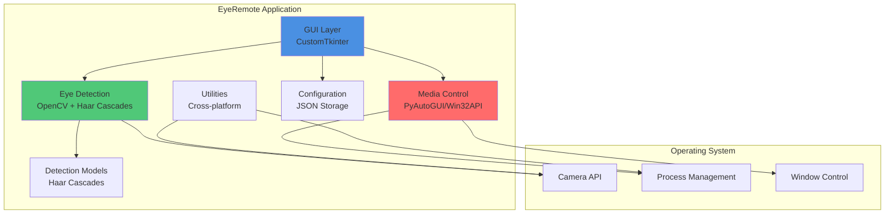

### Detection Flow Sequence

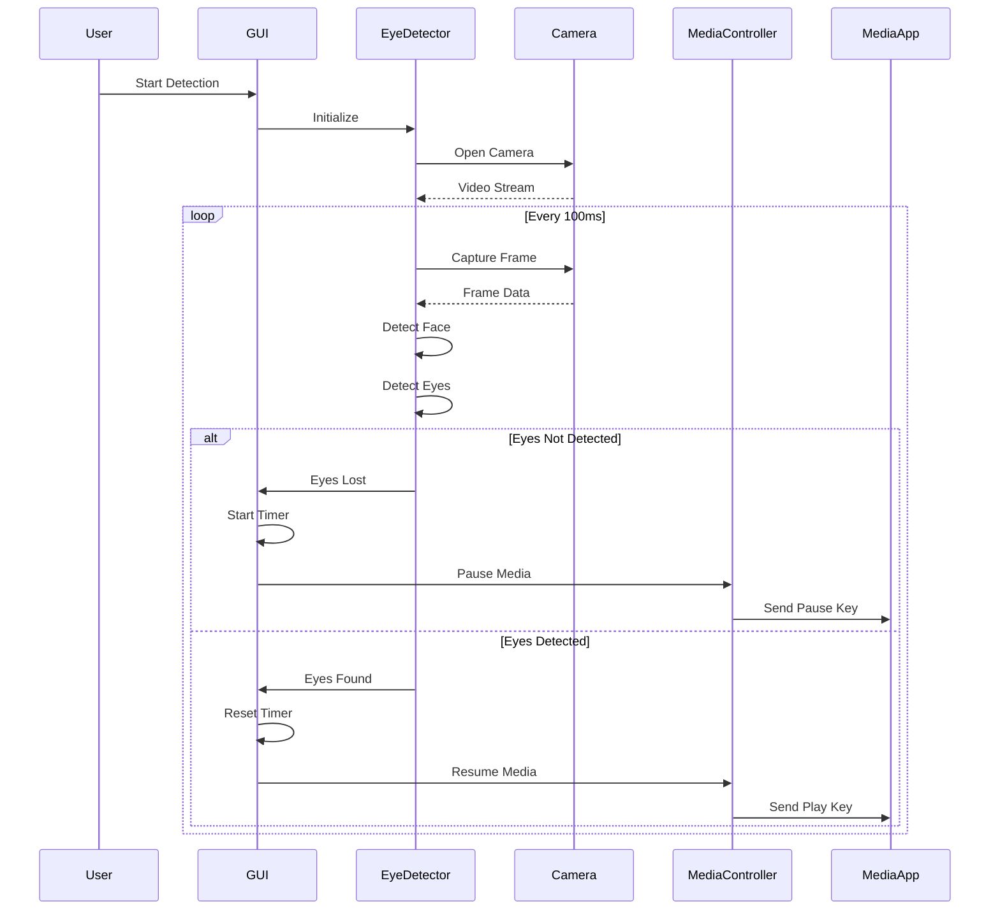

### Application State Machine

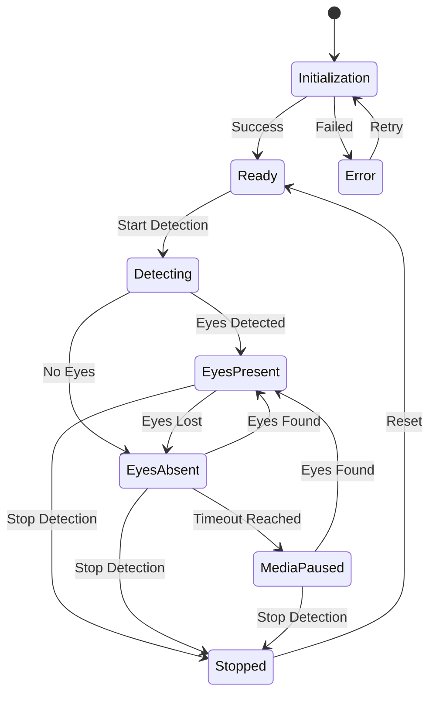

### Threading Model

The application uses a multi-threaded architecture for optimal performance:

- **Main Thread**: GUI rendering and user interaction
- **Detection Thread**: Camera capture and eye detection processing
- **Background Threads**: Media control and system monitoring

---

## Core Components

### 1. EyeDetector (`app/eye_detector.py`)

The core computer vision component responsible for face and eye detection.

#### Class Interface

```python
class EyeDetector:
    def __init__(self, camera_index: int = 0)
    def detect_eyes(self, max_faces: int = 1) -> bool
    def detect_eyes_with_details(self, max_faces: int = 1) -> Tuple[bool, List[Tuple]]
    def calculate_eye_aspect_ratio(self, eye_region: np.ndarray) -> float
    def get_face_detection_with_visualization(self) -> Optional[np.ndarray]
    def cleanup(self)
```

#### Detection Pipeline

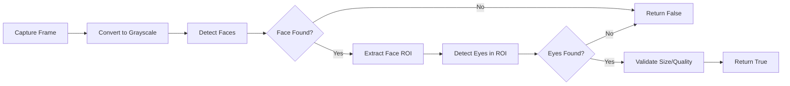

#### Configuration Parameters

| Parameter | Default | Description |
|-----------|---------|-------------|
| Camera Resolution | 640x480 | Video capture resolution |
| Frame Rate | 30 FPS | Processing frame rate |
| Scale Factor | 1.1 | Haar cascade scale factor |
| Min Neighbors (Face) | 5 | Face detection threshold |
| Min Neighbors (Eyes) | 3 | Eye detection threshold |
| Min Face Size | 30x30 px | Minimum detectable face |
| Min Eye Size | 20x20 px | Minimum detectable eye |

#### State Smoothing Algorithm

Prevents false positives from temporary detection failures:

```python
# Configuration
EYES_PRESENT_THRESHOLD = 2  # Frames to confirm eyes are present
NO_EYES_THRESHOLD = 3       # Frames to confirm eyes are gone

# Algorithm
if eyes_detected:
    no_eyes_counter = 0
    eyes_present_counter += 1
    if eyes_present_counter >= EYES_PRESENT_THRESHOLD:
        eyes_detected_stable_state = True
else:
    eyes_present_counter = 0
    no_eyes_counter += 1
    if no_eyes_counter >= NO_EYES_THRESHOLD:
        eyes_detected_stable_state = False
```

### 2. EyeRemoteApp (`app/main.py`)

The main application class managing the GUI and coordinating all components.

#### Key Responsibilities

- **UI Management**: CustomTkinter-based modern interface
- **State Coordination**: Tracks and manages detection states
- **Media Control**: Orchestrates play/pause functionality
- **Configuration**: Manages user settings and preferences
- **Error Handling**: Comprehensive error handling with user feedback

#### Class Methods

```python
class EyeRemoteApp:
    def __init__(self)
    def start_detection(self)
    def stop_detection(self)
    def test_media_key(self)
    def save_config(self) -> bool
    def load_config(self)
    def update_status(self, message: str)
    def log_activity(self, message: str)
```

### 3. Config (`app/config.py`)

Configuration management system using JSON for persistence.

#### Default Configuration

```json
{
  "timeout": 3,
  "max_faces": 1,
  "target_app": "Any",
  "camera_index": 0,
  "eye_ar_threshold": 0.25,
  "window_geometry": "600x500",
  "always_on_top": false,
  "minimize_to_tray": true
}
```

#### Configuration Methods

| Method | Parameters | Returns | Description |
|--------|------------|---------|-------------|
| `load()` | None | None | Loads configuration from file |
| `save()` | None | None | Persists configuration to JSON |
| `get()` | key, default | Any | Retrieves configuration value |
| `set()` | key, value | None | Sets configuration value |
| `reset_to_defaults()` | None | None | Restores default configuration |

### 4. Utils (`app/utils.py`)

Cross-platform utility functions for system interaction.

#### Key Functions

- `get_active_window_info()`: Gets current window information
- `is_media_application()`: Identifies media applications
- `get_camera_list()`: Enumerates available cameras
- `check_camera_permissions()`: Verifies camera access
- `get_system_info()`: Collects system information for debugging
- `check_dependencies()`: Validates required dependencies

---

## Eye Detection Algorithm

### Two-Stage Detection Process

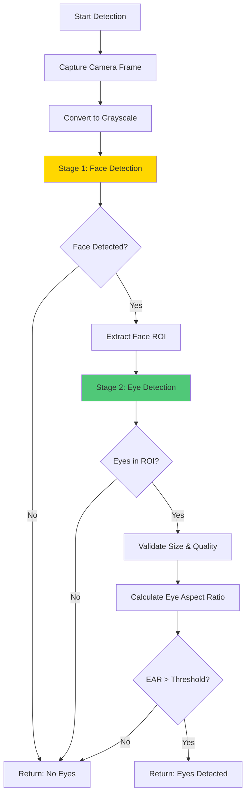

### Stage 1: Face Detection

Uses Haar Cascade classifier for robust face detection:

```python
faces = face_cascade.detectMultiScale(
    gray,
    scaleFactor=1.1,      # Image pyramid scaling factor
    minNeighbors=5,       # Minimum neighbors for detection
    minSize=(30, 30),     # Minimum face size
    flags=cv2.CASCADE_SCALE_IMAGE
)
```

### Stage 2: Eye Detection

Detects eyes within identified face regions:

```python
eyes = eye_cascade.detectMultiScale(
    face_gray,
    scaleFactor=1.1,      # Image pyramid scaling factor
    minNeighbors=3,       # Minimum neighbors for detection
    minSize=(20, 20)      # Minimum eye size
)
```

### Eye Aspect Ratio (EAR) Calculation

Enhanced accuracy through aspect ratio analysis:

```python
def calculate_eye_aspect_ratio(self, eye_region: np.ndarray) -> float:
    """Calculate Eye Aspect Ratio for detection quality"""
    # Apply Gaussian blur for noise reduction
    eye_region = cv2.GaussianBlur(eye_region, (5, 5), 0)
    
    # Find contours
    contours, _ = cv2.findContours(
        eye_region, 
        cv2.RETR_EXTERNAL, 
        cv2.CHAIN_APPROX_SIMPLE
    )
    
    if not contours:
        return 0.0
    
    # Get largest contour (the eye)
    largest_contour = max(contours, key=cv2.contourArea)
    
    # Calculate aspect ratio
    x, y, w, h = cv2.boundingRect(largest_contour)
    return w / h if h > 0 else 0.0
```

### Performance Optimizations

| Optimization | Benefit | Implementation |
|--------------|---------|----------------|
| Frame Rate Control | Balanced accuracy/performance | Limited to 30 FPS |
| Region of Interest | Faster eye detection | Eyes only searched in face ROI |
| State Smoothing | Reduced false positives | Multi-frame confirmation |
| Resource Cleanup | Memory efficiency | Proper camera release |

---

## Media Control System

### Multi-Platform Architecture

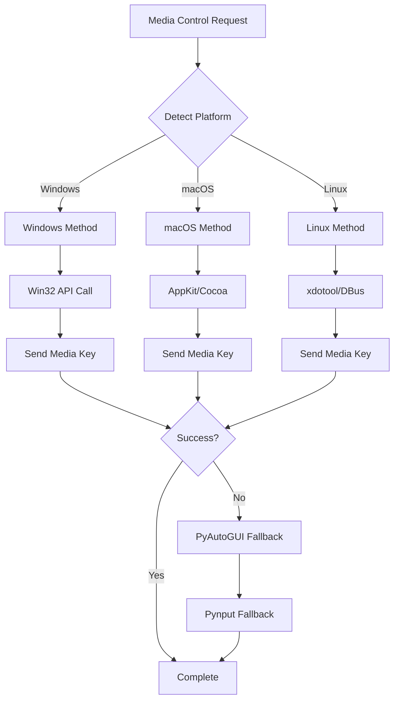

### Platform-Specific Implementations

#### Windows (Primary Method)

Direct window messaging for maximum reliability:

```python
import win32api
import win32con

WM_APPCOMMAND = 0x0319
APPCOMMAND_MEDIA_PLAY_PAUSE = 14

lparam = APPCOMMAND_MEDIA_PLAY_PAUSE << 16
win32api.PostMessage(target_hwnd, WM_APPCOMMAND, 0, lparam)
```

#### Cross-Platform Fallback

Universal compatibility layer:

```python
# Method 1: PyAutoGUI
import pyautogui
pyautogui.press('playpause')

# Method 2: Pynput (Secondary fallback)
from pynput.keyboard import Key, Controller
keyboard = Controller()
keyboard.press(Key.media_play_pause)
keyboard.release(Key.media_play_pause)
```

### Application Targeting

#### Target Detection Process

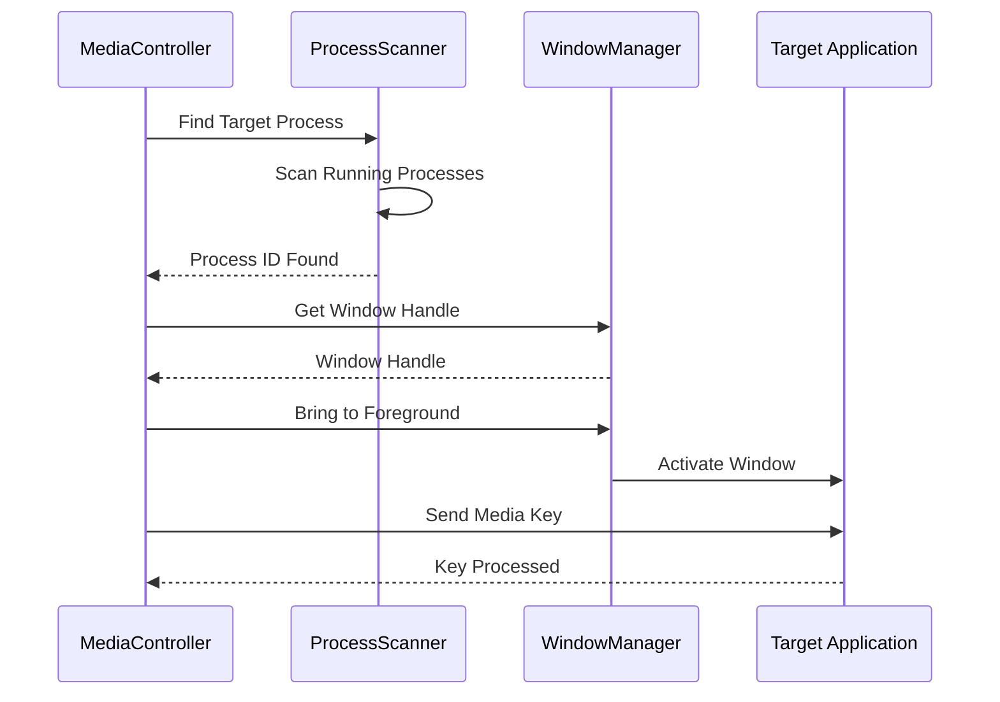

#### Target Application Detection

```python
def _focus_target_app(self, target_app_name: str, is_test: bool = False):
    """Focus the target application before sending media keys"""
    target_pid = None
    
    # Find process by name
    for proc in psutil.process_iter(['pid', 'name']):
        if target_app_name.lower() in proc.info['name'].lower():
            target_pid = proc.info['pid']
            break
    
    # Platform-specific window activation
    if sys.platform == "win32":
        # Windows: Use win32gui for window management
        hwnd = win32gui.FindWindow(None, target_app_name)
        win32gui.SetForegroundWindow(hwnd)
    elif sys.platform == "darwin":
        # macOS: Use AppKit for application activation
        NSWorkspace.sharedWorkspace().launchApplication_(target_app_name)
    elif sys.platform == "linux":
        # Linux: Use xdotool for window control
        subprocess.call(['xdotool', 'search', '--name', target_app_name, 'windowactivate'])
```

---

## Configuration Management

### Configuration File Structure

The `eyeremote_config.json` file stores all user preferences:

```json
{
  "timeout": 3,                    // Attention timeout in seconds (1-30)
  "max_faces": 1,                  // Maximum faces to monitor (1-5)
  "target_app": "Any",             // Target application ("Any" or specific app)
  "camera_index": 0,               // Camera device index (0-9)
  "eye_ar_threshold": 0.25,        // Eye aspect ratio threshold (0.1-0.5)
  "window_geometry": "600x500",    // Window size and position
  "always_on_top": false,          // Keep window on top flag
  "minimize_to_tray": true         // Minimize to system tray flag
}
```

### Configuration Parameters

| Parameter | Type | Range | Default | Description |
|-----------|------|-------|---------|-------------|
| timeout | int | 1-30 | 3 | Seconds before pausing media |
| max_faces | int | 1-5 | 1 | Maximum faces to monitor |
| target_app | string | - | "Any" | Target application name |
| camera_index | int | 0-9 | 0 | Camera device index |
| eye_ar_threshold | float | 0.1-0.5 | 0.25 | Eye detection sensitivity |
| window_geometry | string | - | "600x500" | Window dimensions |
| always_on_top | bool | - | false | Window stays on top |
| minimize_to_tray | bool | - | true | Minimize to system tray |

### Configuration Persistence

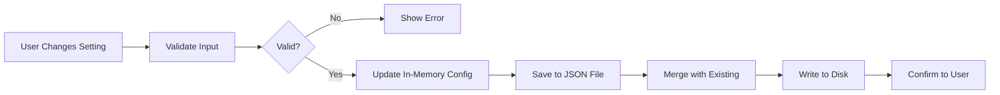

### Configuration API

```python
class Config:
    def __init__(self, config_file: str = "eyeremote_config.json"):
        """Initialize configuration manager"""
        self.config_file = config_file
        self.config = {}
        
    def get(self, key: str, default: Any = None) -> Any:
        """Get configuration value with optional default"""
        return self.config.get(key, default)
    
    def set(self, key: str, value: Any) -> None:
        """Set configuration value"""
        self.config[key] = value
    
    def save(self) -> None:
        """Persist configuration to file"""
        with open(self.config_file, 'w') as f:
            json.dump(self.config, f, indent=2)
    
    def load(self) -> None:
        """Load configuration from file"""
        if os.path.exists(self.config_file):
            with open(self.config_file, 'r') as f:
                self.config = json.load(f)
    
    def reset_to_defaults(self) -> None:
        """Reset to default configuration"""
        self.config = self._get_defaults()
        self.save()
```

---

## User Interface

### GUI Framework

EyeRemote uses **CustomTkinter** for a modern, responsive interface with native look and feel.

#### Key Features

- **Modern Design**: Material Design-inspired components
- **Responsive Layout**: Grid-based layout adapting to window size
- **Theme Support**: Automatic light/dark theme detection
- **Custom Widgets**: Specialized status indicators and controls

### Interface Components

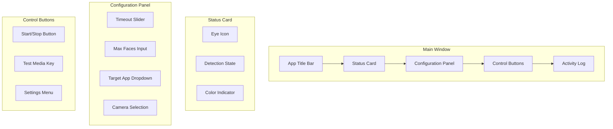

### UI State Management

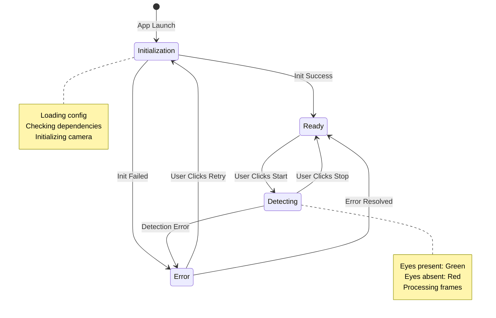

### Component Details

#### 1. Status Card

Visual representation of detection state:

- **Icon**: Large eye icon (👁️)
- **Color Coding**: 
  - 🟢 Green: Eyes detected
  - 🔴 Red: Eyes not detected
  - 🟡 Yellow: Initializing
- **Real-time Updates**: Instant state changes

#### 2. Configuration Panel

User-adjustable settings:

- **Timeout Setting**: Slider (1-30 seconds)
- **Face Count**: Number input (1-5 faces)
- **Target App**: Dropdown (Any/Specific apps)
- **Camera**: Dropdown (Available cameras)
- **Input Validation**: Real-time validation with error messages

#### 3. Control Buttons

Primary interaction controls:

- **Start/Stop**: Toggle detection on/off
- **Test Media Key**: Verify media control functionality
- **Settings**: Advanced configuration options

#### 4. Activity Log

Real-time application logging:

- **Timestamps**: ISO 8601 format
- **Scrollable**: Auto-scroll to latest entries
- **Monospace Font**: Easy log parsing
- **Color Coding**: Different colors for different log levels

---

## Installation & Setup

### Quick Start

```bash
# Clone repository
git clone <repository-url>
cd eyeremote-deskapp

# Run automated installer
# Windows:
installers\install.bat

# Linux/macOS:
chmod +x installers/install.sh
./installers/install.sh

# Run application
python eyeremote.py
```

### Automated Installation Scripts

#### Windows (`installers/install.bat`)

```batch
@echo off
echo EyeRemote Installation
echo ====================

echo [1/3] Upgrading pip...
python -m pip install --upgrade pip

echo [2/3] Installing dependencies...
python -m pip install -r requirements.txt

echo [3/3] Downloading detection models...
python models/download_models.py

echo.
echo Installation complete!
echo Run: python eyeremote.py
pause
```

#### Linux/macOS (`installers/install.sh`)

```bash
#!/bin/bash
echo "EyeRemote Installation"
echo "===================="

echo "[1/4] Upgrading pip..."
python3 -m pip install --upgrade pip

echo "[2/4] Installing dependencies..."
python3 -m pip install -r requirements.txt

echo "[3/4] Downloading models..."
python3 models/download_models.py

echo "[4/4] Creating desktop entry..."
cat > ~/.local/share/applications/eyeremote.desktop << EOF
[Desktop Entry]
Name=EyeRemote
Exec=python3 $(pwd)/eyeremote.py
Icon=$(pwd)/docs/AppScreen.png
Type=Application
Categories=Utility;
EOF

echo "Installation complete!"
echo "Run: python3 eyeremote.py"
```

### Manual Installation

#### Step 1: Install Python

Ensure Python 3.7 or higher is installed:

```bash
python --version  # Should show 3.7+
```

#### Step 2: Install Dependencies

```bash
pip install -r requirements.txt
```

#### Step 3: Download Detection Models

```bash
python models/download_models.py
```

#### Step 4: Verify Installation

```bash
python scripts/test_setup.py
```

### System Requirements

#### Minimum Requirements

| Component | Requirement |
|-----------|-------------|
| Python | 3.7 or higher |
| OS | Windows 10+, macOS 10.14+, Linux |
| RAM | 2GB minimum |
| Camera | USB webcam or built-in camera |
| Storage | 100MB free space |
| CPU | Dual-core processor |

#### Recommended Requirements

| Component | Requirement |
|-----------|-------------|
| Python | 3.9 or higher |
| RAM | 8GB or more |
| Camera | HD webcam (720p+) |
| CPU | Quad-core processor |
| Display | 1920x1080 or higher |

### Dependencies

#### Core Dependencies

```txt
opencv-python>=4.8.0      # Computer vision and camera
numpy>=1.26.0             # Numerical computations
pyautogui>=0.9.54         # Cross-platform automation
Pillow>=10.0.0            # Image processing
psutil>=5.9.0             # Process management
customtkinter>=5.2.0      # Modern GUI framework
pynput>=1.7.6             # Advanced input control
```

#### Platform-Specific Dependencies

**Windows:**
```bash
pip install pywin32>=306  # Windows API access
```

**macOS:**
```bash
pip install pyobjc-framework-Cocoa>=9.0  # macOS AppKit
```

**Linux:**
```bash
sudo apt-get install xdotool  # X11 window control
```

### Verification

Run comprehensive setup test:

```bash
python scripts/test_setup.py
```

Expected output:
```
✓ Python version: 3.9.7
✓ OpenCV installed: 4.8.1
✓ Camera access: Available
✓ Haar cascades: Found
✓ Dependencies: All installed
✓ Configuration: Loaded successfully

Setup verification complete!
```

---

## API Reference

### EyeDetector Class

Computer vision component for eye detection.

#### Constructor

```python
EyeDetector(camera_index: int = 0)
```

**Parameters:**
- `camera_index` (int): Camera device index (default: 0)

**Example:**
```python
detector = EyeDetector(camera_index=0)
```

#### Methods

##### `detect_eyes(max_faces: int = 1) -> bool`

Detects if eyes are visible in the current frame.

**Parameters:**
- `max_faces` (int): Maximum number of faces to detect (default: 1)

**Returns:**
- `bool`: True if eyes are detected, False otherwise

**Example:**
```python
eyes_present = detector.detect_eyes(max_faces=2)
if eyes_present:
    print("Eyes detected!")
```

##### `detect_eyes_with_details(max_faces: int = 1) -> Tuple[bool, List[Tuple]]`

Detects eyes and returns detailed location information.

**Parameters:**
- `max_faces` (int): Maximum number of faces to detect

**Returns:**
- `Tuple[bool, List[Tuple]]`: (eyes_detected, list of (x, y, w, h) rectangles)

**Example:**
```python
detected, eye_locations = detector.detect_eyes_with_details()
for x, y, w, h in eye_locations:
    print(f"Eye at ({x}, {y}) size {w}x{h}")
```

##### `calculate_eye_aspect_ratio(eye_region: np.ndarray) -> float`

Calculates Eye Aspect Ratio for enhanced accuracy.

**Parameters:**
- `eye_region` (np.ndarray): Grayscale image of eye region

**Returns:**
- `float`: Eye aspect ratio (width/height)

**Example:**
```python
ear = detector.calculate_eye_aspect_ratio(eye_image)
if ear > 0.25:
    print("Eye is open")
```

##### `get_face_detection_with_visualization() -> Optional[np.ndarray]`

Returns current frame with detection rectangles drawn.

**Returns:**
- `Optional[np.ndarray]`: Annotated frame or None if unavailable

**Example:**
```python
frame = detector.get_face_detection_with_visualization()
if frame is not None:
    cv2.imshow('Detection', frame)
```

##### `cleanup()`

Releases camera resources and closes windows.

**Example:**
```python
detector.cleanup()
```

---

### EyeRemoteApp Class

Main application class coordinating all components.

#### Constructor

```python
EyeRemoteApp()
```

Initializes the application with GUI and default configuration.

**Example:**
```python
app = EyeRemoteApp()
app.mainloop()
```

#### Methods

##### `start_detection()`

Starts the eye detection process.

**Example:**
```python
app.start_detection()
```

##### `stop_detection()`

Stops the eye detection process.

**Example:**
```python
app.stop_detection()
```

##### `test_media_key()`

Tests media key functionality independently.

**Example:**
```python
app.test_media_key()
```

##### `save_config() -> bool`

Saves current configuration to file.

**Returns:**
- `bool`: True if successful, False if validation failed

**Example:**
```python
if app.save_config():
    print("Configuration saved")
```

##### `load_config()`

Loads configuration from file.

**Example:**
```python
app.load_config()
```

---

### Config Class

Configuration management with JSON persistence.

#### Constructor

```python
Config(config_file: str = "eyeremote_config.json")
```

**Parameters:**
- `config_file` (str): Path to configuration file

**Example:**
```python
config = Config("my_config.json")
```

#### Methods

##### `get(key: str, default: Any = None) -> Any`

Retrieves configuration value.

**Parameters:**
- `key` (str): Configuration key
- `default` (Any): Default value if key not found

**Returns:**
- Configuration value or default

**Example:**
```python
timeout = config.get('timeout', 3)
```

##### `set(key: str, value: Any)`

Sets configuration value.

**Parameters:**
- `key` (str): Configuration key
- `value` (Any): Value to set

**Example:**
```python
config.set('timeout', 5)
```

##### `save()`

Persists configuration to file.

**Example:**
```python
config.save()
```

##### `load()`

Loads configuration from file.

**Example:**
```python
config.load()
```

##### `reset_to_defaults()`

Resets configuration to default values.

**Example:**
```python
config.reset_to_defaults()
```

---

## Development Guide

### Project Structure

```
eyeremote-deskapp/
├── app/
│   ├── __init__.py          # Package initialization
│   ├── main.py              # Main application class
│   ├── eye_detector.py      # Eye detection logic
│   ├── config.py            # Configuration management
│   └── utils.py             # Utility functions
├── models/
│   ├── download_models.py   # Model download script
│   └── .gitkeep
├── scripts/
│   ├── debug.py             # Debug utilities
│   ├── test_setup.py        # Setup verification
│   ├── test_eye_detection.py
│   └── test_keypress.py
├── installers/
│   ├── install.bat          # Windows installer
│   └── install.sh           # Linux/macOS installer
├── docs/
│   ├── TECHNICAL.md         # This document
│   └── QUICKSTART.md        # Quick start guide
├── eyeremote.py             # Entry point
└── requirements.txt         # Python dependencies
```

### Development Setup

#### 1. Fork and Clone

```bash
git clone <your-fork-url>
cd eyeremote-deskapp
```

#### 2. Create Virtual Environment

```bash
# Windows
python -m venv venv
venv\Scripts\activate

# Linux/macOS
python3 -m venv venv
source venv/bin/activate
```

#### 3. Install Dependencies

```bash
pip install -r requirements.txt
```

#### 4. Download Models

```bash
python models/download_models.py
```

#### 5. Run Tests

```bash
python scripts/test_setup.py
```

### Code Style Guidelines

#### Python Style (PEP 8)

- **Line Length**: Maximum 100 characters
- **Indentation**: 4 spaces (no tabs)
- **Naming**:
  - Functions/variables: `snake_case`
  - Classes: `PascalCase`
  - Constants: `UPPER_SNAKE_CASE`
- **Type Hints**: Required for all function parameters and returns
- **Docstrings**: Required for all public methods and classes

#### Example

```python
def detect_eyes(self, max_faces: int = 1) -> bool:
    """
    Detect if eyes are visible in the current frame.
    
    This method captures a frame from the camera and uses Haar cascades
    to detect faces and eyes within those faces.
    
    Args:
        max_faces: Maximum number of faces to detect (default: 1)
        
    Returns:
        True if at least one pair of eyes is detected, False otherwise
        
    Raises:
        CameraError: If camera is not initialized
    """
    if not self.is_initialized:
        raise CameraError("Camera not initialized")
    
    # Implementation here
    return eyes_detected
```

### Testing

#### Unit Tests

```bash
python -m pytest tests/ -v
```

#### Integration Tests

```bash
python scripts/test_setup.py
```

#### Debug Mode

Real-time visualization:

```bash
python scripts/debug.py
```

### Building and Distribution

#### Windows Executable (PyInstaller)

```bash
pip install pyinstaller
pyinstaller --onefile --windowed --icon=icon.ico eyeremote.py
```

#### Linux Package

```bash
python setup.py sdist bdist_wheel
```

#### macOS App Bundle

```bash
pip install py2app
py2app --make-setup eyeremote.py
python setup.py py2app
```

---

## Troubleshooting

### Decision Tree

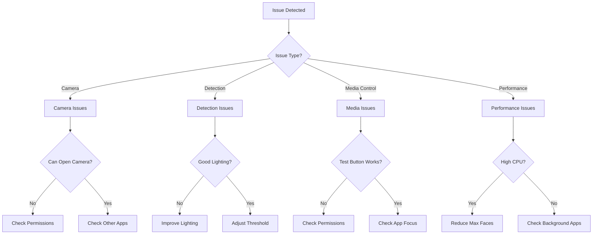

### Common Issues

#### 1. Camera Not Working

**Symptoms:**
- "Could not open camera" error
- No video feed in debug mode
- Black screen in visualization

**Solutions:**


**Debug Steps:**

```bash
# Test camera directly
python scripts/debug.py

# Verify camera access
python scripts/test_setup.py

# List available cameras
python -c "from app.utils import get_camera_list; print(get_camera_list())"
```

**Platform-Specific:**

**Windows:**
- Check: Settings → Privacy → Camera
- Ensure antivirus isn't blocking camera

**macOS:**
- Check: System Preferences → Security & Privacy → Camera
- Grant permission to Terminal/Python

**Linux:**
- Check: `v4l2-ctl --list-devices`
- Verify user in `video` group: `sudo usermod -a -G video $USER`

#### 2. Eye Detection Not Working

**Symptoms:**
- No eyes detected despite clear visibility
- Inconsistent detection results
- Too many false negatives

**Solutions:**

| Issue | Solution |
|-------|----------|
| Poor lighting | Improve ambient light, avoid backlighting |
| Distance | Position face 2-3 feet from camera |
| Angle | Face camera directly |
| Threshold | Lower `eye_ar_threshold` in config |
| Camera quality | Use higher resolution camera |

**Configuration Tuning:**

```json
{
  "eye_ar_threshold": 0.20,  // Lower = more sensitive (default: 0.25)
  "max_faces": 1,            // Single face for better accuracy
  "camera_index": 0          // Try different cameras
}
```

#### 3. Media Control Issues

**Symptoms:**
- Media doesn't pause/resume
- Wrong application receives commands
- Inconsistent media control

**Solutions:**

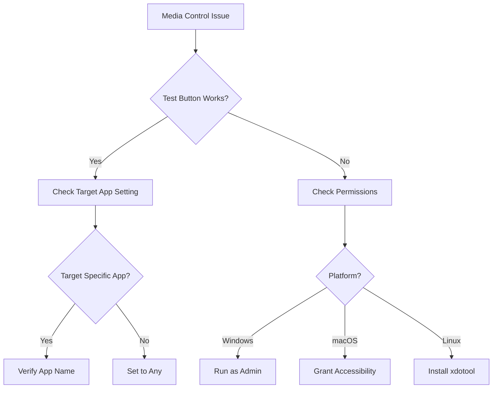

**Platform-Specific Solutions:**

**Windows:**
```bash
# Check pywin32 installation
python -c "import win32api; print('OK')"

# Run as administrator if needed
```

**macOS:**
```bash
# Grant accessibility permissions
# System Preferences → Security & Privacy → Accessibility
# Add Terminal or Python to allowed apps
```

**Linux:**
```bash
# Install xdotool
sudo apt-get install xdotool

# Verify X11 permissions
xdotool --version
```

#### 4. Performance Issues

**Symptoms:**
- High CPU usage (>50%)
- Laggy detection
- Application freezes
- Slow response time

**Solutions:**

| Symptom | Solution |
|---------|----------|
| High CPU | Reduce max_faces to 1 |
| Laggy | Close other camera apps |
| Freezing | Increase timeout value |
| Slow | Improve lighting for faster detection |

**Performance Configuration:**

```json
{
  "max_faces": 1,           // Single face = lower CPU
  "eye_ar_threshold": 0.30, // Higher = faster processing
  "timeout": 5              // Longer = less frequent checks
}
```

#### 5. Dependency Issues

**Symptoms:**
- Import errors
- Missing modules
- Version conflicts

**Solutions:**

```bash
# Reinstall all dependencies
pip uninstall -r requirements.txt -y
pip install -r requirements.txt

# Update pip
python -m pip install --upgrade pip

# Check Python version
python --version  # Must be 3.7+

# Verify specific packages
python -c "import cv2; print(cv2.__version__)"
python -c "import customtkinter; print('OK')"
```

### Debug Tools

#### 1. Setup Test Script

Comprehensive component verification:

```bash
python scripts/test_setup.py
```

**Output:**
```
Testing EyeRemote Setup
======================
✓ Python version: 3.9.7
✓ OpenCV: 4.8.1
✓ Camera access: Available
✓ Haar cascades: Found
✓ Dependencies: All installed
✓ Configuration: Valid
```

#### 2. Debug Mode

Real-time visualization:

```bash
python scripts/debug.py
```

Features:
- Live camera feed
- Face/eye detection rectangles
- FPS counter
- Detection status

#### 3. Keypress Test

Independent media key testing:

```bash
python scripts/test_keypress.py
```

Tests all media control methods independently.

### Log Analysis

#### Log Message Reference

| Message | Meaning | Action |
|---------|---------|--------|
| `Eye detection started` | Detection initialized | Normal operation |
| `Media paused - eyes not detected for Xs` | Auto-pause triggered | Verify timeout setting |
| `Media resumed - eyes detected` | Auto-resume triggered | Normal operation |
| `Initialization failed: [error]` | Startup error | Check error details |
| `Focus attempt failed: [error]` | Window focus issue | Check target app |
| `Camera not accessible` | Camera error | Check permissions |

#### Getting Help

1. **Check Logs**: Review activity log for specific errors
2. **Run Diagnostics**: Execute `python scripts/test_setup.py`
3. **Verify Configuration**: Validate `eyeremote_config.json`
4. **System Information**: 
   ```bash
   python -c "from app.utils import get_system_info; print(get_system_info())"
   ```

---

## Security & Privacy

### Privacy-First Architecture

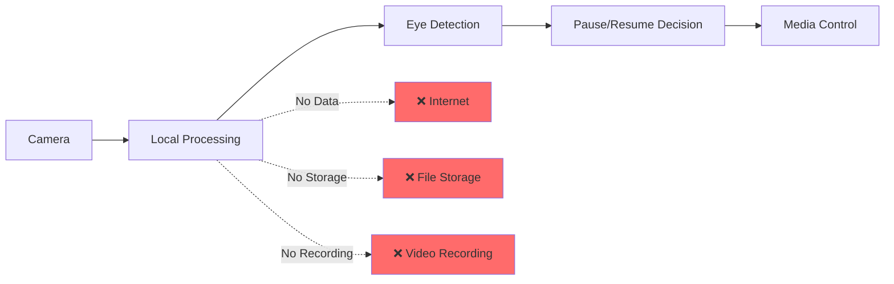

### Privacy Principles

#### Complete Local Processing

- ✅ **No Internet Required**: All processing happens offline
- ✅ **No Data Transmission**: Zero network requests
- ✅ **No Cloud Dependencies**: Works completely air-gapped
- ✅ **No Telemetry**: No analytics or usage tracking

#### Data Handling

| Data Type | Storage | Transmission | Processing |
|-----------|---------|--------------|------------|
| Camera frames | Memory only | Never | Local CPU |
| Face detection | Memory only | Never | Local CPU |
| Eye detection | Memory only | Never | Local CPU |
| Configuration | Local JSON | Never | Local read/write |
| User data | None | Never | N/A |

### Security Considerations

#### Input Validation

All user inputs are validated:

```python
def validate_timeout(value: int) -> bool:
    """Validate timeout is within acceptable range"""
    return 1 <= value <= 30

def validate_camera_index(value: int) -> bool:
    """Validate camera index is valid"""
    return 0 <= value <= 9

def sanitize_file_path(path: str) -> str:
    """Sanitize file paths to prevent directory traversal"""
    return os.path.normpath(path)
```

#### Error Handling

Secure error messages:

- ❌ **Bad**: `"Failed to open camera at /dev/video0 for user john"`
- ✅ **Good**: `"Could not access camera"`

#### Code Security

- **Open Source**: Full transparency, no hidden functionality
- **No Obfuscation**: Readable, auditable code
- **Regular Reviews**: Community security reviews
- **Dependency Scanning**: Regular vulnerability checks

### Required Permissions

#### Windows

| Permission | Purpose | Location |
|------------|---------|----------|
| Camera Access | Eye detection | Settings → Privacy → Camera |
| Input Monitoring | Media control | Automatic (no setting) |

#### macOS

| Permission | Purpose | Location |
|------------|---------|----------|
| Camera Access | Eye detection | System Preferences → Security & Privacy → Camera |
| Accessibility | Media control | System Preferences → Security & Privacy → Accessibility |

#### Linux

| Permission | Purpose | Configuration |
|------------|---------|---------------|
| Camera Access | Eye detection | User in `video` group |
| X11 Input | Media control | xdotool installation |

#### Checking Permissions

```bash
# Verify camera permissions
python -c "from app.utils import check_camera_permissions; print(check_camera_permissions())"
```

---

## Performance Optimization

### Detection Performance

#### Frame Rate Optimization

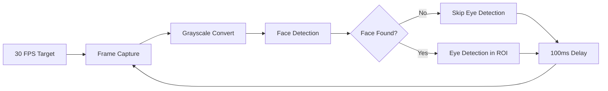

#### Performance Metrics

| Metric | Target | Typical | Impact |
|--------|--------|---------|--------|
| FPS | 30 | 25-30 | Smooth detection |
| CPU Usage | <30% | 15-25% | Low system impact |
| Memory | <200MB | 150MB | Minimal footprint |
| Latency | <100ms | 50-80ms | Responsive control |

### Memory Management

#### Resource Lifecycle

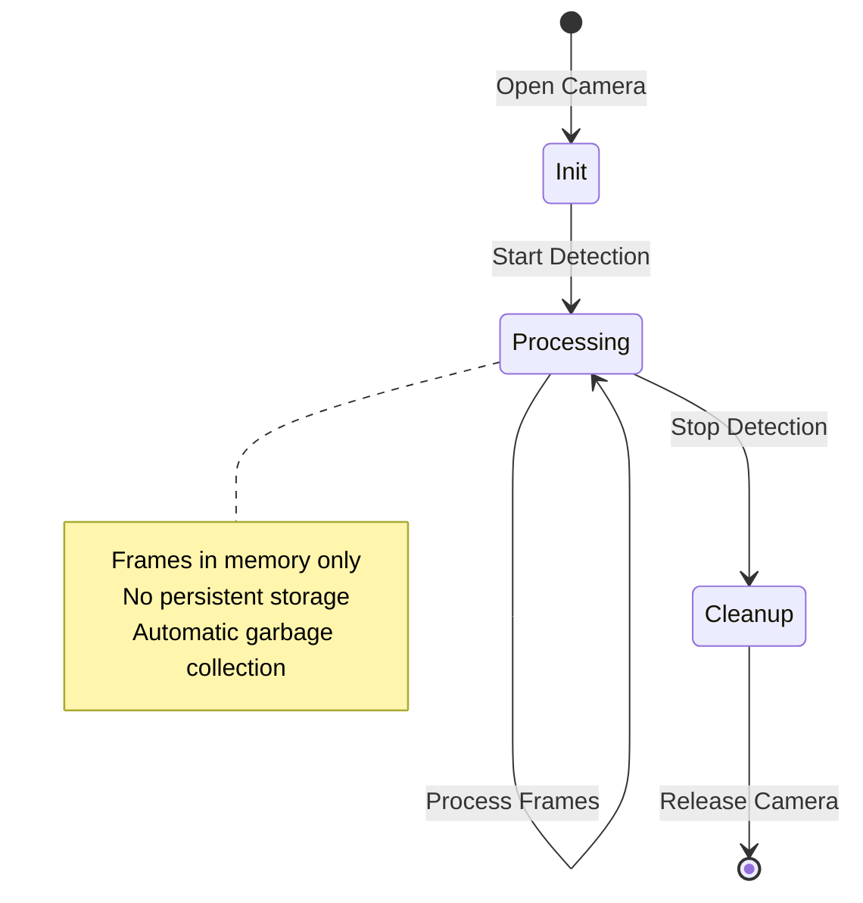

#### Memory Optimization

```python
def cleanup(self):
    """Efficient resource cleanup"""
    if self.cap:
        self.cap.release()  # Release camera immediately
    cv2.destroyAllWindows()  # Close all OpenCV windows
    self.is_initialized = False
    gc.collect()  # Force garbage collection
```

### CPU Optimization

#### Detection Pipeline Optimizations

| Stage | Optimization | Benefit |
|-------|--------------|---------|
| Frame Capture | 640x480 resolution | 4x faster than 1080p |
| Preprocessing | Grayscale conversion | 3x faster processing |
| Face Detection | Single face mode | 2x faster than multi-face |
| Eye Detection | ROI only | 5x faster than full frame |
| State Smoothing | Multi-frame confirmation | Reduced false positives |

### Configuration Presets

#### High Performance Mode

Optimized for low-end systems:

```json
{
  "max_faces": 1,
  "eye_ar_threshold": 0.30,
  "timeout": 5,
  "camera_index": 0
}
```

**Expected Performance:**
- CPU Usage: 10-15%
- Memory: ~100MB
- Detection Accuracy: Good

#### Balanced Mode (Default)

Good balance of accuracy and performance:

```json
{
  "max_faces": 1,
  "eye_ar_threshold": 0.25,
  "timeout": 3,
  "camera_index": 0
}
```

**Expected Performance:**
- CPU Usage: 15-25%
- Memory: ~150MB
- Detection Accuracy: Very Good

#### High Accuracy Mode

Maximum detection accuracy:

```json
{
  "max_faces": 3,
  "eye_ar_threshold": 0.20,
  "timeout": 2,
  "camera_index": 0
}
```

**Expected Performance:**
- CPU Usage: 25-40%
- Memory: ~200MB
- Detection Accuracy: Excellent

---

## Contributing Guidelines

### How to Contribute

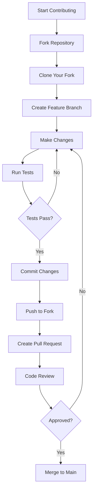

### Contribution Workflow

#### 1. Fork Repository

```bash
# Fork on GitHub, then clone
git clone https://github.com/YOUR_USERNAME/eyeremote-deskapp.git
cd eyeremote-deskapp
```

#### 2. Create Feature Branch

```bash
git checkout -b feature/your-feature-name
```

Branch naming conventions:
- `feature/` - New features
- `bugfix/` - Bug fixes
- `docs/` - Documentation updates
- `refactor/` - Code refactoring

#### 3. Make Changes

Follow code style guidelines and add tests for new functionality.

#### 4. Test Changes

```bash
# Run all tests
python scripts/test_setup.py
python scripts/debug.py

# Verify code style
pylint app/

# Run unit tests (if available)
pytest tests/
```

#### 5. Commit Changes

```bash
git add .
git commit -m "feat: add new detection algorithm"
```

Commit message format:
- `feat:` - New feature
- `fix:` - Bug fix
- `docs:` - Documentation
- `refactor:` - Code refactoring
- `test:` - Test additions

#### 6. Submit Pull Request

```bash
git push origin feature/your-feature-name
```

Then create PR on GitHub with:
- Clear description of changes
- Reference to related issues
- Screenshots/videos if UI changes

### Areas for Contribution

#### 1. Enhanced Detection

- Improved eye detection algorithms
- Support for glasses and accessories
- Better handling of different lighting conditions
- Facial landmark detection integration
- Machine learning-based detection

#### 2. Media Player Support

- Additional media player integrations
- Platform-specific optimizations
- Better application targeting
- Support for streaming services

#### 3. User Interface

- Additional configuration options
- Better visual feedback
- Accessibility improvements
- Multi-language support
- Themes and customization

#### 4. Performance

- Detection pipeline optimization
- Better resource management
- Improved threading model
- GPU acceleration support

#### 5. Cross-Platform

- Better Linux support
- macOS-specific optimizations
- Mobile platform support (future)
- Raspberry Pi support

### Development Standards

#### Code Quality

- ✅ Follow PEP 8 style guidelines
- ✅ Use type hints throughout
- ✅ Comprehensive error handling
- ✅ Unit tests for new functionality
- ✅ Documentation for all public APIs

#### Testing Requirements

All contributions must include:

1. **Unit Tests**: For new functions/methods
2. **Integration Tests**: For new features
3. **Manual Testing**: Verified on target platform
4. **Documentation**: Updated relevant docs

#### Documentation

- Update `TECHNICAL.md` for architecture changes
- Add docstrings to all new functions
- Include usage examples
- Update README if needed

### Issue Reporting

#### Bug Report Template

```markdown
## Bug Description
[Clear description of the bug]

## System Information
- OS: [Windows 10/macOS 12/Ubuntu 22.04]
- Python Version: [3.9.7]
- EyeRemote Version: [1.0.0]

## Steps to Reproduce
1. Step one
2. Step two
3. ...

## Expected Behavior
[What should happen]

## Actual Behavior
[What actually happens]

## Error Messages
```
[Paste error messages/logs]
```

## Screenshots
[If applicable]
```

#### Feature Request Template

```markdown
## Feature Description
[Clear description of the feature]

## Use Case
[Why is this feature needed?]

## Proposed Solution
[How should it work?]

## Alternatives Considered
[Other approaches you've thought about]

## Additional Context
[Any other relevant information]
```

---

## Conclusion

EyeRemote represents a comprehensive solution for attention-based media control, successfully combining:

- **Computer Vision**: Robust eye detection using OpenCV and Haar cascades
- **Cross-Platform Automation**: Seamless media control across Windows, macOS, and Linux
- **Modern UI Design**: Intuitive interface built with CustomTkinter
- **Privacy-First Architecture**: Complete local processing with no cloud dependencies

### Key Achievements

✅ **Privacy**: Zero data transmission, all processing local  
✅ **Performance**: Optimized for low CPU usage (<25%) and memory (~150MB)  
✅ **Reliability**: State smoothing and fallback mechanisms  
✅ **Usability**: Simple interface with comprehensive configuration  
✅ **Maintainability**: Clean architecture with extensive documentation

### Architecture Strengths

The modular design enables:
- Easy extension and customization
- Independent component testing
- Clear separation of concerns
- Simple debugging and maintenance

### For Users

EyeRemote provides:
- Seamless hands-free media control
- Complete privacy and security
- Cross-platform compatibility
- No internet requirement

### For Developers

The codebase offers:
- Solid foundation for computer vision applications
- Cross-platform development patterns
- Modern Python GUI programming examples
- Comprehensive testing and debugging tools

### Future Directions

Potential areas for expansion:
- Machine learning-based detection
- GPU acceleration support
- Mobile platform ports
- Integration with smart home systems
- Advanced accessibility features

---

## Version History

- **v1.0.0** (Current): Initial release with core functionality
  - OpenCV-based eye detection
  - Cross-platform media control
  - CustomTkinter GUI
  - JSON configuration
  - Comprehensive documentation

---

## References

### Technologies

- **OpenCV**: https://opencv.org/
- **CustomTkinter**: https://github.com/TomSchimansky/CustomTkinter
- **PyAutoGUI**: https://pyautogui.readthedocs.io/
- **Haar Cascades**: https://docs.opencv.org/master/db/d28/tutorial_cascade_classifier.html

### Resources

- **Computer Vision**: https://opencv-python-tutroals.readthedocs.io/
- **Python GUI**: https://docs.python.org/3/library/tkinter.html
- **Cross-Platform**: https://docs.python.org/3/library/sys.html

---

**Document Version**: 2.0  
**Last Updated**: 2025  
**Maintained By**: EyeRemote Development Team

